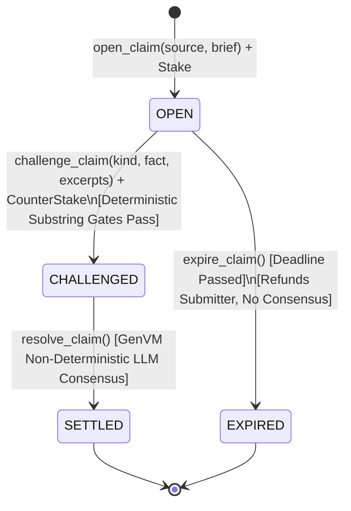

# CoverLock — Asymmetric Coverage Escrow

> **GenLayer Intelligent Contract** · Standalone Asymmetric Coverage & Entailment Escrow  
> **Network:** GenLayer StudioNet  
> **Primary Deployed Contract:** `0x19d9512004570B24040Cc65B2B659DAf62395a85`  
> **Expiry Test Deployed Contract:** `0xcC76113987057c2e83291378d2b8e24dAb0412E7`

---

## 1. Overview & Purpose

**CoverLock** is an Intelligent Contract for decentralized, high-stakes verification of summary fidelity. It implements an **asymmetric coverage and entailment escrow**.

In release management, security reporting, grant governance, and post-mortems, parties publish condensed accounts ("briefs", changelogs, summaries) based on privileged, authoritative source records (diffs, audit logs, raw specs, security advisories).

Traditional oracles and escrows evaluate symmetric equivalence (whether two documents mean the same thing) or subjective quality. **CoverLock is strictly asymmetric:**
- **The source document is privileged.** It is the sole ground truth.
- **The brief is an unprivileged summary.** A brief can be 100% truthful on every sentence it contains and **still fail**, if it quietly omitted a material fact or breaking change present in the source.

Anyone staking funds on a brief claims that the brief covers all material facts from the source without contradiction or fabrication. Anyone who disagrees stakes counter-funds and names one specific gap (`OMISSION`, `CONTRADICTION`, or `FABRICATION`) backed by deterministic, pre-LLM literal substring citations.

---

## 2. Why CoverLock Is Fundamentally Different From Prior Systems

| Architecture Attribute | Symmetric Arbitrations / Prior Models | CoverLock (Asymmetric Coverage Escrow) |
| :--- | :--- | :--- |
| **Document Hierarchy** | Symmetric (both documents are peer claims) | **Strictly Asymmetric** (Source is privileged ground truth; Brief is an accountable condensation) |
| **Failure Mode** | Contradiction or falsehood only | **Omission Gap**: A brief containing only true statements fails if a material source fact was omitted |
| **Settlement Topology** | Percentage splits, subjective weights, or scalar scores | **Kind-Invariant Binary Enum**: `CHALLENGER_WINS`, `SUBMITTER_WINS`, `REFUND` |
| **Citation Verification** | Delegated to LLM or unchecked string prompts | **Deterministic Pre-Consensus Python Substring Gates** (20–280 chars) verified before consensus |
| **Consensus Target** | Full reasoning text or complex structs | **Strict Verdict-Only Equivalence** (`CONFIRMED` vs `REJECTED`) |
| **State Synchronization** | Mutable settlement status fields that can drift | **Single Source of Truth**: Settlement is purely derived at read/settle time from stored verdict |

---

## 3. State Machine & Architecture

CoverLock claims progress through a strict, finite state machine:



### States
1. **`OPEN` (0)**: Submitter staked GEN backing the complete and faithful coverage of the source by the brief. The challenge window is active.
2. **`CHALLENGED` (1)**: A challenger staked equal counter-funds, citing a specific gap (`OMISSION`, `CONTRADICTION`, `FABRICATION`) with verified literal substrings.
3. **`SETTLED` (2)**: GenVM comparative consensus evaluated the claim against the source. Payout executed via `derive_settlement(verdict)`.
4. **`EXPIRED` (3)**: The challenge window closed without any challenge. Submitter reclaimed 100% of their stake without invoking LLM consensus.

---

## 4. Deterministic Pre-LLM Substring Gates

To prevent spam, hallucinations, and malicious gas consumption, CoverLock enforces deterministic Python substring validation **before** any LLM or validator execution:

```python
def validate_excerpts_and_caps(
    source: str,
    brief: str,
    kind: str,
    fact: str,
    source_excerpt: str,
    brief_excerpt: str,
) -> None:
    # 1. Size bounds
    if not (1 <= len(source) <= 8000):
        raise UserError("Source length must be between 1 and 8000 chars")
    if not (1 <= len(brief) <= 4000):
        raise UserError("Brief length must be between 1 and 4000 chars")
    if not (1 <= len(fact) <= 500):
        raise UserError("Fact length must be between 1 and 500 chars")

    # 2. Kind validation
    if kind not in ("OMISSION", "CONTRADICTION", "FABRICATION"):
        raise UserError(f"Invalid kind: '{kind}'")

    # 3. Deterministic literal substring checks
    if kind in ("OMISSION", "CONTRADICTION"):
        if not (20 <= len(source_excerpt) <= 280):
            raise UserError("source_excerpt length must be between 20 and 280 chars")
        if source_excerpt not in source:
            raise UserError("source_excerpt is not a literal substring of the committed source text")

    if kind in ("CONTRADICTION", "FABRICATION"):
        if not (20 <= len(brief_excerpt) <= 280):
            raise UserError("brief_excerpt length must be between 20 and 280 chars")
        if brief_excerpt not in brief:
            raise UserError("brief_excerpt is not a literal substring of the committed brief text")
```

If an excerpt does not literally exist in the committed text or fails size constraints, `challenge_claim` reverts immediately in native Python. Invalid challenges never enter consensus.

---

## 5. Five Review Scars Addressed

CoverLock incorporates specific architectural defenses derived from past smart contract edge cases:

### 1. FairSplit Fix — Payout Invariance & Verdict-Only Equivalence
- **Problem**: Payouts that vary based on allegation category or validator score distribution allow minor reasoning differences to break consensus.
- **CoverLock Solution**: Settlement is a closed enum (`CHALLENGER_WINS`, `SUBMITTER_WINS`, `REFUND`), not a percentage or slider. `OMISSION`, `CONTRADICTION`, and `FABRICATION` pay the exact same 100% pool to the challenger if `CONFIRMED`. Validator comparison checks `leader_verdict == my_verdict` only, ignoring formatting variations in the explanation string.

### 2. Concord Fix — Single Source of Truth
- **Problem**: Maintaining duplicate settlement state variables causes on-chain views and execution logic to desynchronize.
- **CoverLock Solution**: Payout and status are derived at read and settle time from the stored verdict using a pure function `derive_settlement(verdict)`. `recompute_settlement(claim_id)` strictly equals `get_claim(claim_id)['settlement']`.

### 3. VersionLock Fix — Schema-Aware JSON Parsing (Zero Regex)
- **Problem**: Parsing LLM JSON responses with regular expressions is vulnerable to nested homonyms (e.g. `{"meta": {"verdict": "CONFIRMED"}}` overriding top-level `"verdict": "REJECTED"`).
- **CoverLock Solution**: Responses are parsed strictly using `json.loads`. Only the top-level `verdict` key is extracted. Any malformed output safely defaults to `REJECTED`.

### 4. ProofReader Fix — Pre-Consensus Substring Verification
- **Problem**: Allowing unverified excerpt citations allows challengers to hallucinate quotes or challenge with fabricated context.
- **CoverLock Solution**: Source and brief citations must be literal substrings (20..280 characters) verified on-chain in Python before entering consensus.

### 5. Ironclad Fix — Bounded History & Strict Storage Caps
- **Problem**: Unbounded input sizes and unlimited challenges per claim can exhaust contract memory and cause DoS.
- **CoverLock Solution**: Strict caps (`source <= 8000`, `brief <= 4000`, `fact <= 500`). Exactly one active challenge permitted per claim (`claim.state == STATE_OPEN`).

---

## 6. Live StudioNet Deployment & Verification

CoverLock is actively deployed and verified on GenLayer StudioNet.

### Contract Addresses
- **Main CoverLock Contract:** [`0x19d9512004570B24040Cc65B2B659DAf62395a85`](file:///d:/coverlock/contracts/coverlock.py)
  - Deployment Tx: `0x24704ea9c686b657f7476f7795578cda942ba01e8a2af9ea567e25da83499ea8`
  - Challenge Window: 86,400 seconds (24 hours)
- **Expiry Test Contract:** `0xcC76113987057c2e83291378d2b8e24dAb0412E7`
  - Deployment Tx: `0xfefb1b8cc3d4693aa41d56ac7ae1865550c2f6b048ed674c29e5e7410d402de2`
  - Challenge Window: 5 seconds

### On-Chain Source Match Verification
The deployed contract source was verified byte-for-byte against local [`contracts/coverlock.py`](file:///d:/coverlock/contracts/coverlock.py) via `gen_getContractCode`:
- **Source Match:** `100% EXACT MATCH`
- **JSON Parser:** Contains strict `json.loads` schema extraction
- **Regex Check:** Zero regex search over JSON

---

## 7. Real Live StudioNet Execution Results

All three state machine pathways were executed live on-chain with real StudioNet validators:

### Scenario 1: Real Omission → `CONFIRMED` → Challenger Wins Pool
- **Source:** Protocol Patch Notes v3.2.0 detailing critical deprecation/removal of `/v1/auth` endpoint and routine index tuning.
- **Brief:** Release notes claiming routine performance optimizations and index tuning (omitted auth removal).
- **Allegation:** `OMISSION` citing source excerpt `"Deprecated and permanently removed legacy /v1/auth endpoint, requiring all clients to migrate to OAuth2 tokens."`
- **Transactions:**
  - Open Claim: `0x9be011f80689474deba5f03d3c0de2734a62a1bdb1319e4368c4af65aa3e5d32` (Stake: 0.1 GEN)
  - Challenge: `0x5af1819acb8a2809722b01ba0a489755d6ce92a865f5d9ca8643b5051379a674` (Counter-Stake: 0.1 GEN)
  - Resolution: `0x0dcd543021139dba895fc5718cd0cd389ce7dc6ee5ab86406e5b2e078b6b67b5`
- **On-Chain Result:**
  - **Verdict:** `CONFIRMED`
  - **Validator Reason:** *"The source explicitly states that the legacy /v1/auth endpoint was deprecated and permanently removed, a material change for users, yet the brief's excerpt contains no mention of this fact."*
  - **Settlement:** `CHALLENGER_WINS`
  - **Paid To:** Challenger (`0xBb4e0fD1CEaC9F8db17242CF86decDcdd45FA48a`)
  - **Recompute Match:** `True`

### Scenario 2: Faithful Brief + Bogus Omission → `REJECTED` → Submitter Wins Pool
- **Source:** Release Notes v2.4 detailing PostgreSQL UUIDv7 migration and 500 req/min rate limits.
- **Brief:** Faithful summary covering Postgres UUIDv7 migration and rate limits.
- **Allegation:** `OMISSION` alleging authentication was deleted (a fact not present in the source).
- **Transactions:**
  - Open Claim: `0x6b5905626aae02c51157945e1208d0f5c9e6c4bfe76d868cc01c7468fa3705cc` (Stake: 0.1 GEN)
  - Challenge: `0x66fb3daef1c52620e0fd8a38c77d359b900d0d9639dc1548d6b1e6e54d9652c0` (Counter-Stake: 0.1 GEN)
  - Resolution: `0x52024709e6366842bf583eb1ae62c7851908eeb04833a76a3e08481b588ab1b0`
- **On-Chain Result:**
  - **Verdict:** `REJECTED`
  - **Validator Reason:** *"The alleged omitted fact (authentication was deleted) does not appear in the source text, so there is no omission to confirm."*
  - **Settlement:** `SUBMITTER_WINS`
  - **Paid To:** Submitter (`0x9CE8B4b8A355421f01779Ebd0c49e22A8F1FF0DD`)
  - **Recompute Match:** `True`

### Scenario 3: Unchallenged Expiry → `REFUND` → Submitter Refunded (No Consensus)
- **Contract:** `0xcC76113987057c2e83291378d2b8e24dAb0412E7` (5-second challenge window)
- **Transactions:**
  - Open Claim: `0x245de00b258a1ef757e85ee3a3a58f34bf0fd41f28a5bf35ca6f5ef3cccb1b52` (Stake: 0.1 GEN)
  - Expire Claim: `0xff37d4a60d4864cac15e565677fff69d00a526e0071eb2538276dabdfc37339a`
- **On-Chain Result:**
  - **Final State:** `EXPIRED`
  - **Verdict:** `""` (Empty string)
  - **Consensus Ran:** `False`
  - **Settlement:** `REFUND`
  - **Paid To:** `REFUNDED_TO_CLAIMANT`
  - **Recompute Match:** `True`

---

## 8. Test Suite Summary

The direct-mode test suite in [`tests/test_coverlock.py`](file:///d:/coverlock/tests/test_coverlock.py) runs locally using `gltest`:

```bash
python -m pytest tests/test_coverlock.py -v
```

### Test Results: 9/9 Passed (100%)
- `test_faithful_brief_bogus_omission_rejected`: **PASSED** (Happy path: submitter wins on bogus challenge)
- `test_real_omission_confirmed`: **PASSED** (Unhappy path 1: omission confirmed, challenger wins)
- `test_real_contradiction_confirmed`: **PASSED** (Unhappy path 2: contradiction confirmed, challenger wins)
- `test_unchallenged_expiry_refund`: **PASSED** (Expiry path: refunds submitter without consensus)
- `test_fairsplit_scar_payout_invariance`: **PASSED** (FairSplit fix: payout invariant across kinds)
- `test_concord_scar_single_source_of_truth`: **PASSED** (Concord fix: recompute strictly matches get_claim)
- `test_versionlock_scar_json_parsing_and_no_regex`: **PASSED** (VersionLock fix: schema-aware json.loads)
- `test_proofreader_scar_excerpt_validation_pre_llm`: **PASSED** (ProofReader fix: pre-consensus substring checks)
- `test_ironclad_scar_caps_and_bounded_history`: **PASSED** (Ironclad fix: bounded sizes & max 1 challenge)

---

## 9. Developer Integration Guide

### Step 1: Open an Escrow Claim
```python
from genlayer_py.client.genlayer_client import GenLayerClient
from genlayer_py.chains.studionet import studionet

client = GenLayerClient(studionet)
contract_address = "0x19d9512004570B24040Cc65B2B659DAf62395a85"

# Submitter stakes 1 GEN backing summary coverage
tx = client.write_contract(
    address=contract_address,
    function_name="open_claim",
    account=my_account,
    value=10**18,
    args=[source_document_text, summary_brief_text],
)
client.wait_for_transaction_receipt(tx)
```

### Step 2: Challenge a Gap (Omission or Contradiction)
```python
# Challenger cites a literal 20-280 char substring from the source
tx_challenge = client.write_contract(
    address=contract_address,
    function_name="challenge_claim",
    account=challenger_account,
    value=10**18,
    args=[
        "claim_0",
        "OMISSION",
        "Changelog omitted the breaking deprecation of /v1/auth",
        "Deprecated and permanently removed legacy /v1/auth endpoint", # literal substring
        "",
    ],
)
client.wait_for_transaction_receipt(tx_challenge)
```

### Step 3: Resolve Claim via GenVM
```python
# Anyone can trigger resolution once challenged
tx_resolve = client.write_contract(
    address=contract_address,
    function_name="resolve_claim",
    account=my_account,
    value=0,
    args=["claim_0"],
)
client.wait_for_transaction_receipt(tx_resolve)
```

### Step 4: Query Settlement State
```python
claim = client.read_contract(
    address=contract_address,
    function_name="get_claim",
    account=my_account,
    args=["claim_0"],
)

print("State:", claim["state_name"])       # "SETTLED"
print("Verdict:", claim["verdict"])         # "CONFIRMED" or "REJECTED"
print("Settlement:", claim["settlement"])   # "CHALLENGER_WINS" or "SUBMITTER_WINS"
print("Paid To:", claim["paid_to"])         # Winning address
```

---

## 10. License & Standalone Integrity

CoverLock is standalone, open-source software built specifically for GenLayer Intelligent Contracts.
All prompts, state-machine architectures, parsing routines, and verification pipelines are natively authored for asymmetric coverage escrow.
