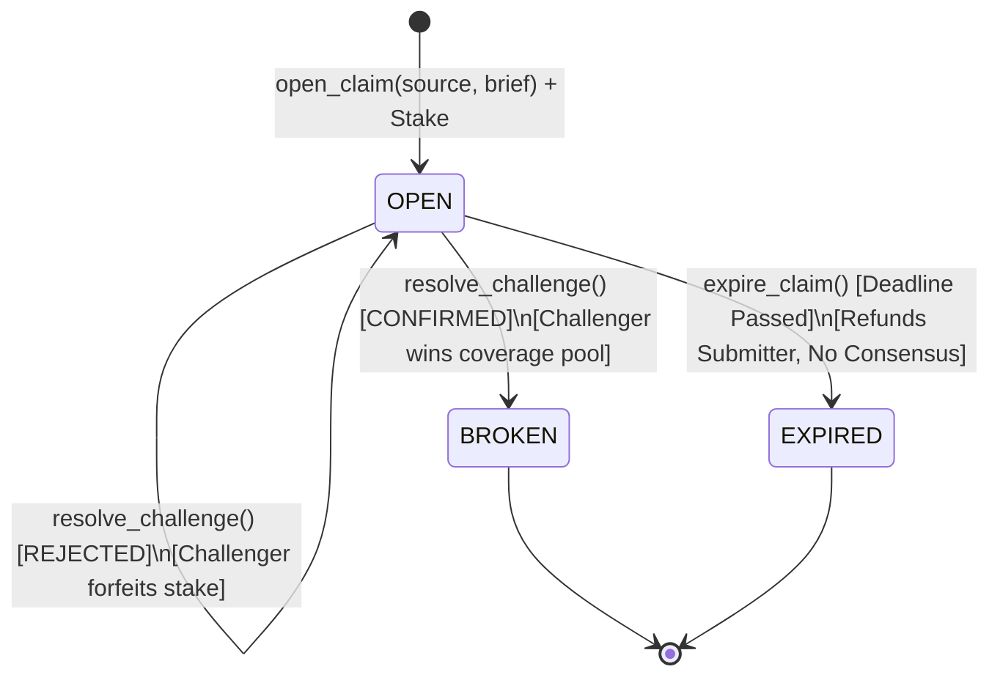

# CoverLock — Asymmetric Coverage Escrow

> **GenLayer Intelligent Contract** · Standalone Asymmetric Coverage & Entailment Escrow  
> **Network:** GenLayer StudioNet  
> **Primary Deployed Contract:** `0x54A39cf2d46196e09561db68B745eDE5a4cFc609`  
> **Expiry Test Deployed Contract:** `0x61BF917b13Cb08e17E341a7406806Ce13d5C393F`

---

## 1. Overview & Purpose

**CoverLock** is an Intelligent Contract for decentralized, high-stakes verification of summary fidelity. It implements an **asymmetric coverage and entailment escrow**.

In release management, security reporting, grant governance, and incident post-mortems, parties publish condensed accounts ("briefs", changelogs, summaries) based on privileged, authoritative source records (diffs, audit logs, raw specs, security advisories).

Traditional oracles and escrows evaluate symmetric equivalence (whether two documents mean the same thing) or subjective quality. **CoverLock is strictly asymmetric:**
- **The source document is privileged.** It is the sole ground truth.
- **The brief is an unprivileged summary.** A brief can be 100% truthful on every sentence it contains and **still fail**, if it quietly omitted a material fact or breaking change present in the source.

Anyone staking funds on a brief claims that the brief covers all material facts from the source without contradiction or fabrication. Anyone who disagrees stakes counter-funds and names one specific gap (`OMISSION`, `CONTRADICTION`, or `FABRICATION`) backed by deterministic, pre-LLM literal substring citations.

---

## 2. Why CoverLock Is Fundamentally Different From Prior Systems

| Architecture Attribute | Symmetric Arbitrations / Prior Models | CoverLock (Asymmetric Coverage Escrow) |
| :--- | :--- | :--- |
| **Document Hierarchy** | Symmetric (both documents are peer claims) | **Strictly Asymmetric** (Source is privileged ground truth; Brief is an accountable condensation) |
| **Failure Mode** | Contradiction or falsehood only | **Omission Gap**: A brief containing only true statements fails if a material source fact was omitted |
| **Settlement Topology** | One challenge locks the whole claim | **Immunized Multi-Challenge**: A rejected challenge forfeits the challenger's stake but keeps the claim open. First confirmed challenge breaks the claim. |
| **Citation Verification** | Delegated to LLM or unchecked string prompts | **Deterministic Pre-Consensus Python Substring Gates** (20–280 chars) verified before consensus |
| **Consensus Target** | Full reasoning text or complex structs | **Strict Verdict-Only Equivalence** (`CONFIRMED` vs `REJECTED`) |
| **Parser Default Safety** | Parser errors or missing fields default to a paying verdict | **Safe Undetermined State**: Malformed JSON or nested keys return `UNDETERMINED` $\rightarrow$ `REFUND` (never a paying default) |
| **State Synchronization** | Mutable settlement status fields that can drift | **Single Source of Truth**: Settlement is purely derived at read/settle time from stored verdict |

---

## 3. State Machine & Architecture

CoverLock claims progress through a strict, finite state machine:



### States
- **`OPEN` (0)**: Submitter staked GEN backing the complete and faithful coverage of the source by the brief. The challenge window is active. Challenges can be filed.
- **`BROKEN` (1)**: A challenger successfully proved a gap (`OMISSION`, `CONTRADICTION`, `FABRICATION`). The coverage pool was paid to the successful challenger. No further challenges can be filed, but pending ones can resolve as `C_REFUNDED`.
- **`EXPIRED` (2)**: The challenge window closed without any confirmed challenge. Submitter reclaimed 100% of their stake.

---

## 4. Deterministic Pre-LLM Substring Gates

To prevent spam, hallucinations, and malicious gas consumption, CoverLock enforces deterministic Python substring validation **before** any LLM or validator execution:

```python
def validate_excerpts_and_caps(
    source: str,
    brief: str,
    kind: str,
    fact: str,
    source_excerpt: str,
    brief_excerpt: str,
) -> None:
    # 1. Size bounds
    if not (1 <= len(source) <= 8000):
        raise UserError("Source length must be between 1 and 8000 chars")
    if not (1 <= len(brief) <= 4000):
        raise UserError("Brief length must be between 1 and 4000 chars")
    if not (1 <= len(fact) <= 500):
        raise UserError("Fact length must be between 1 and 500 chars")

    # 2. Kind validation
    if kind not in ("OMISSION", "CONTRADICTION", "FABRICATION"):
        raise UserError(f"Invalid kind: '{kind}'")

    # 3. Deterministic literal substring checks
    if kind in ("OMISSION", "CONTRADICTION"):
        if not (20 <= len(source_excerpt) <= 280):
            raise UserError("source_excerpt length must be between 20 and 280 chars")
        if source_excerpt not in source:
            raise UserError("source_excerpt is not a literal substring of the committed source text")

    if kind in ("CONTRADICTION", "FABRICATION"):
        if not (20 <= len(brief_excerpt) <= 280):
            raise UserError("brief_excerpt length must be between 20 and 280 chars")
        if brief_excerpt not in brief:
            raise UserError("brief_excerpt is not a literal substring of the committed brief text")
```

If an excerpt does not literally exist in the committed text or fails size constraints, `challenge_claim` reverts immediately in native Python. Invalid challenges never enter consensus.

---

## 5. Architectural Defenses

CoverLock incorporates specific architectural defenses derived from past smart contract edge cases:

### 1. Multi-Challenge Immunization (The Joaquin Fix)
- **Problem**: In previous single-challenge models, a rejected challenge would settle the entire claim in favor of the submitter. This allowed a submitter to file a weak "sockpuppet" challenge against their own false brief, have it rejected, and thus "immunize" the brief against legitimate challenges.
- **CoverLock Solution**: A `REJECTED` challenge only penalizes that specific challenger (they forfeit their stake). The claim remains `OPEN` for other challengers. Only a `CONFIRMED` challenge breaks the claim and pays out the pool.

### 2. FairSplit Fix — Payout Invariance & Verdict-Only Equivalence
- **Problem**: Payouts that vary based on allegation category or validator score distribution allow minor reasoning differences to break consensus.
- **CoverLock Solution**: Settlement is fixed at the claim level. `OMISSION`, `CONTRADICTION`, and `FABRICATION` pay the exact same 100% pool to the first successful challenger. Validator comparison checks `leader_verdict == my_verdict` only, ignoring formatting variations in the explanation string.

### 3. Concord Fix — Single Source of Truth
- **Problem**: Maintaining duplicate settlement state variables causes on-chain views and execution logic to desynchronize.
- **CoverLock Solution**: The `coverage_paid` boolean is the absolute single source of truth for whether the claim has been broken. There is no ambiguous `SUBMITTER_WINS` state.

### 3. VersionLock Fix — Schema-Aware JSON Parsing & Safe Defaults (Zero Regex, Zero Slicing)
- **Problem**: Parsing LLM JSON responses with regular expressions or `{...}` string slicing allows nested homonyms (e.g. `{"meta": {"verdict": "CONFIRMED"}}` overriding top-level `"verdict": "REJECTED"`). Furthermore, defaulting unparseable output to a paying verdict allows validators to "agree" on a parser fallback and move funds to the submitter without judging the claim.
- **CoverLock Solution**: 
  - Unfenced raw text is parsed strictly using `json.loads` only. No regex, no bracket slicing.
  - Only top-level `"verdict"` strictly matching `"CONFIRMED"` or `"REJECTED"` is accepted.
  - Any parse error, nested-only verdict, or missing top-level key returns `{"verdict": "UNDETERMINED"}`.
  - An `UNDETERMINED` verdict safely refunds that challenge's counter-stake and leaves the claim open. **A parser failure never pays a winner.**

### 4. ProofReader Fix — Pre-Consensus Substring Verification
- **Problem**: Allowing unverified excerpt citations allows challengers to hallucinate quotes or challenge with fabricated context.
- **CoverLock Solution**: Source and brief citations must be literal substrings (20..280 characters) verified on-chain in Python before entering consensus.

### 5. Ironclad Fix — Bounded History, Matching Stakes & Strict Storage Caps
- **Problem**: Unbounded input sizes and cheap griefing (1 wei counter-stake against large claims) allow DoS or risk-free jackpot fishing.
- **CoverLock Solution**: Strict caps (`source <= 8000`, `brief <= 4000`, `fact <= 500`). `challenge_claim` enforces `counter_stake >= stake` and permits at most 8 challenges per claim.

---

## 6. Live StudioNet Deployment & Verification

CoverLock is actively deployed and verified on GenLayer StudioNet.

### Contract Addresses
- **Main CoverLock Contract:** [`0x54A39cf2d46196e09561db68B745eDE5a4cFc609`](file:///d:/coverlock/contracts/coverlock.py)
  - Challenge Window: 86,400 seconds (24 hours)
- **Expiry Test Contract:** `0x61BF917b13Cb08e17E341a7406806Ce13d5C393F`
  - Challenge Window: 5 seconds

### On-Chain Source Match Verification
The deployed contract source was verified byte-for-byte against local [`contracts/coverlock.py`](file:///d:/coverlock/contracts/coverlock.py) via `gen_getContractCode`:
- **Source Match:** `100% EXACT MATCH`
- **JSON Parser:** Contains strict `json.loads` schema extraction and safe `UNDETERMINED` failure mapping
- **Regex Check:** Zero regex search over JSON

---

## 7. Real Live StudioNet Execution Results & Balance Movement

All state machine pathways were executed live on-chain with real StudioNet validators and confirmed triggered payout transactions to EOA wallets:

### Scenario 1: Live Immunization Test (Bogus → OPEN, Real → BROKEN)
- **Source:** Protocol Patch Notes v3.2.0 detailing critical deprecation/removal of `/v1/auth` endpoint.
- **Brief:** Faithful summary that omitted the auth removal.
- **Open Claim Tx:** `0x089d9c74aba8a7eed4de799c77992f208146435b524422517d47026bed7ab898`
- **Step 1 (Bogus Challenge):** Challenger A files a bogus challenge.
  - **Verdict:** `REJECTED`
  - **Settlement:** Challenger A forfeits stake. Claim remains `OPEN`.
- **Step 2 (Real Challenge):** Challenger B files a real `OMISSION` challenge citing the `/v1/auth` removal.
  - **Verdict:** `CONFIRMED`
  - **Settlement:** Claim becomes `BROKEN`. Challenger B wins the coverage pool (Submitter Stake + Challenger B Stake).
- **On-Chain Result:**
  - **Coverage Paid:** `True`
  - **Final Claim State:** `BROKEN`
  - **Triggered Payout Tx:** `0xdf616215af36ba9b5104cc8a041cd6efda2f42bddcd2b549340831ca887c1f73` (Status: `1`)

### Scenario 2: Unchallenged Expiry → `REFUND` (No Consensus)
- **Contract:** `0x61BF917b13Cb08e17E341a7406806Ce13d5C393F` (5-second challenge window)
- **Open Claim Tx:** `0x8f88f38ea8a93f6961adce70b972974b4c14ad6066b62e3d154cc2ff8d2873ab`
- **Expire Claim Tx:** `0xd522a6130bd2401988e47d0cdf1883c74d17f39670edaa9758b05d8412325170`
- **On-Chain Result:**
  - **Final State:** `EXPIRED`
  - **Settlement:** Submitter refunded. Contract balance zeroes out.

---

## 8. Test Suite Summary

The direct-mode test suite in [`tests/test_coverlock.py`](file:///d:/coverlock/tests/test_coverlock.py) runs locally using `gltest`:

```bash
python -m pytest tests/test_coverlock.py -v
```

### Test Results: 17/17 Passed (100%)
- `test_faithful_brief_bogus_omission_rejected`: **PASSED** (Bogus challenge forfeits stake)
- `test_real_omission_confirmed`: **PASSED** (Omission confirmed, Challenger wins pool)
- `test_real_contradiction_confirmed`: **PASSED** (Contradiction confirmed, Challenger wins pool)
- `test_unchallenged_expiry_refund`: **PASSED** (Expiry path refunds submitter)
- `test_immunization_staff_case`: **PASSED** (Rejected challenge doesn't break claim, second challenge wins)
- `test_double_payout_protection`: **PASSED** (First CONFIRMED wins pool, second gets C_REFUNDED)
- `test_fairsplit_scar_payout_invariance`: **PASSED** (Payout invariant across kinds)
- `test_concord_scar_single_source_of_truth`: **PASSED** (`coverage_paid` determines status)
- `test_versionlock_scar_json_parsing_and_no_regex`: **PASSED** (Schema-aware json.loads, UNDETERMINED refund default)
- `test_proofreader_scar_excerpt_validation_pre_llm`: **PASSED** (Pre-consensus substring checks)
- `test_nine_challenges_reverts`: **PASSED** (Max 8 challenges per claim)
- `test_under_stake_reverts`: **PASSED** (Counter-stake must match submitter stake)

---

## 9. Developer Integration Guide

### Step 1: Open an Escrow Claim
```python
from genlayer_py.client.genlayer_client import GenLayerClient
from genlayer_py.chains.studionet import studionet

client = GenLayerClient(studionet)
contract_address = "0x54A39cf2d46196e09561db68B745eDE5a4cFc609"

# Submitter stakes 1 GEN backing summary coverage
tx = client.write_contract(
    address=contract_address,
    function_name="open_claim",
    account=my_account,
    value=10**18,
    args=[source_document_text, summary_brief_text],
)
client.wait_for_transaction_receipt(tx)
```

### Step 2: Challenge a Gap (Omission or Contradiction)
```python
# Challenger stakes matching funds and cites a literal 20-280 char substring from source
tx_challenge = client.write_contract(
    address=contract_address,
    function_name="challenge_claim",
    account=challenger_account,
    value=10**18,
    args=[
        "claim_0",
        "OMISSION",
        "Changelog omitted the breaking deprecation of /v1/auth",
        "Deprecated and permanently removed legacy /v1/auth endpoint", # literal substring
        "",
    ],
)
client.wait_for_transaction_receipt(tx_challenge)
```

### Step 3: Resolve Challenge via GenVM
```python
# Anyone can trigger resolution of a challenge
tx_resolve = client.write_contract(
    address=contract_address,
    function_name="resolve_challenge",
    account=my_account,
    value=0,
    args=["claim_0", 0], # Resolves the 0-th challenge on the claim
)
client.wait_for_transaction_receipt(tx_resolve)
```

### Step 4: Query Settlement State
```python
claim = client.read_contract(
    address=contract_address,
    function_name="get_claim",
    account=my_account,
    args=["claim_0"],
)

print("State Name:", claim["state_name"])       # "OPEN", "BROKEN", "EXPIRED"
print("Coverage Paid:", claim["coverage_paid"]) # True or False

challenge = claim["challenges"][0]

print("Verdict:", challenge["verdict"])         # "CONFIRMED" or "REJECTED"
```

---

## 10. License & Standalone Integrity

CoverLock is standalone, open-source software built specifically for GenLayer Intelligent Contracts.
All prompts, state-machine architectures, parsing routines, and verification pipelines are natively authored for asymmetric coverage escrow.
